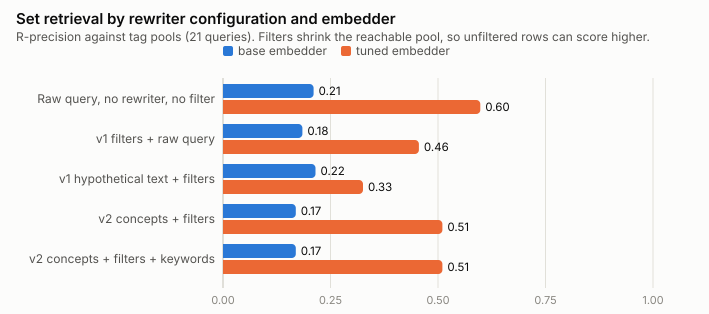
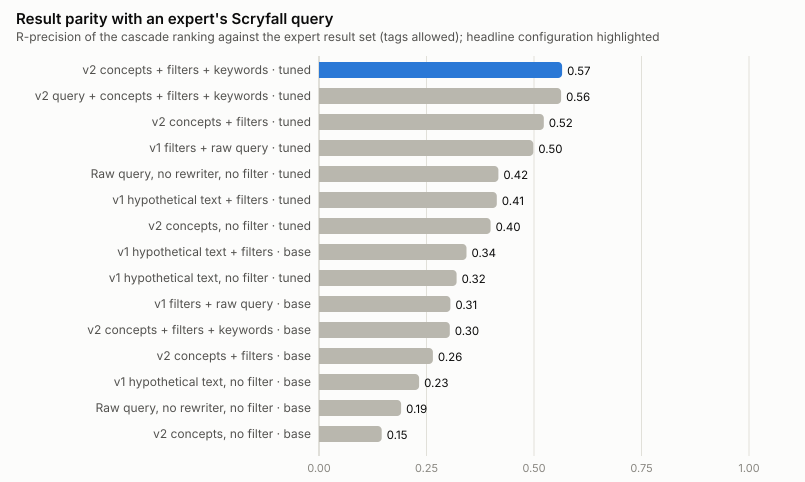
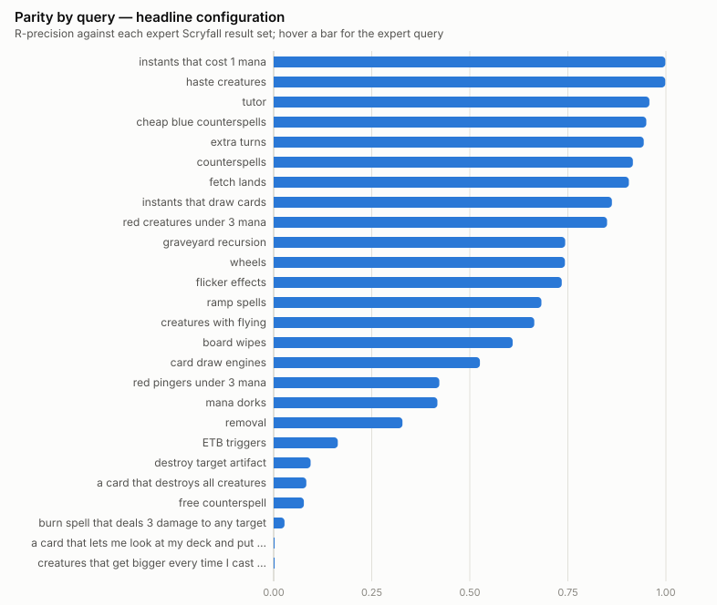

# Results report

Generated 2026-10-04 01:57 UTC at commit `6c71776` by `scripts/generate_report.py` from `experiment_runs` rows since 2026-09-01 (85 rows read, 20 eval cells selected). Eval set: v1-draft. Newest row per (configuration, embedder) wins; superseded ids are in the appendix.

**Headline configuration:** `cascade_v2_concepts_kw` on the tuned embedder (row 101). **Control:** `cascade_hyde_v1` on the base embedder (row 90).

## 1. Configuration grid

P@10 and MRR are against the hand-curated judgments (archetype precision). R-precision, reachable, and depth are set-retrieval measures against each query's tag pool inside the Stage 2 candidate set (21 tag-mapped queries): *R-prec* charges the filter's exclusions to the cascade, *R-prec (reachable)* scores Stage 3's ranking of what the filter admitted, *Reachable* is the share of the pool the filter admitted.

| Configuration | Embedder | Row | P@10 | MRR | R-prec | R-prec (reachable) | Reachable | Depth to 90% (x set) | Stage 1 ms | Stage 1 out tokens |
|---|---|---|---|---|---|---|---|---|---|---|
| Raw query, no rewriter, no filter | base | 88 | 0.031 | 0.067 | 0.211 | 0.211 | 1.000 | 13.47 | — | — |
| Raw query, no rewriter, no filter | tuned (nomic-mtg-v1) | 95 | 0.069 | 0.101 | 0.598 | 0.598 | 1.000 | 3.38 | — | — |
| v1 filters + raw query | base | 89 | 0.050 | 0.129 | 0.185 | 0.297 | 0.680 | 8.38 | 1628 | 42 |
| v1 filters + raw query | tuned (nomic-mtg-v1) | 96 | 0.081 | 0.206 | 0.456 | 0.641 | 0.680 | 1.19 | 1722 | 42 |
| v1 hypothetical text, no filter | base | 91 | 0.085 | 0.269 | 0.273 | 0.273 | 1.000 | 13.23 | 1074 | 42 |
| v1 hypothetical text, no filter | tuned (nomic-mtg-v1) | 98 | 0.077 | 0.196 | 0.459 | 0.459 | 1.000 | 3.76 | 1143 | 42 |
| v1 hypothetical text + filters | base | 90 | 0.112 | 0.294 | 0.215 | 0.346 | 0.680 | 8.38 | 1053 | 42 |
| v1 hypothetical text + filters | tuned (nomic-mtg-v1) | 97 | 0.088 | 0.270 | 0.326 | 0.517 | 0.680 | 3.00 | 1214 | 42 |
| v2 concepts, no filter | base | 93 | 0.035 | 0.135 | 0.215 | 0.215 | 1.000 | 19.77 | 1078 | 28 |
| v2 concepts, no filter | tuned (nomic-mtg-v1) | 100 | 0.077 | 0.146 | 0.623 | 0.623 | 1.000 | 2.12 | 762 | 28 |
| v2 concepts + filters | base | 92 | 0.058 | 0.171 | 0.169 | 0.297 | 0.717 | 7.64 | 890 | 28 |
| v2 concepts + filters | tuned (nomic-mtg-v1) | 99 | 0.092 | 0.196 | 0.510 | 0.681 | 0.717 | 1.24 | 918 | 28 |
| v2 concepts + filters + keywords | base | 94 | 0.058 | 0.171 | 0.169 | 0.297 | 0.717 | 7.64 | 1224 | 28 |
| v2 concepts + filters + keywords | tuned (nomic-mtg-v1) | 101 | 0.096 | 0.200 | 0.510 | 0.681 | 0.717 | 1.24 | 778 | 28 |
| v2 query + concepts + filters + keywords | tuned (nomic-mtg-v1) | 84 | 0.085 | 0.206 | 0.486 | 0.625 | 0.717 | 1.11 | 739 | 28 |
| v2 one-sentence hypothetical + filters | tuned (nomic-mtg-v1) | 52 | 0.085 | 0.153 | 0.533 | 0.625 | 0.810 | 1.19 | 1389 | 62 |
| Tag-label oracle + v1 filters | base | 28 | 0.065 | 0.185 | — | — | — | — | — | — |
| Tag-label oracle + v1 filters | tuned (nomic-mtg-v1) | 46 | 0.073 | 0.153 | 0.536 | 0.728 | 0.680 | 1.11 | — | — |
| Tag-label oracle, no filter | base | 29 | 0.035 | 0.100 | — | — | — | — | — | — |
| Tag-label oracle, no filter | tuned (nomic-mtg-v1) | 27 | 0.081 | 0.122 | — | — | — | — | — | — |

## 2. By query category (control vs headline)

| Category | n | Control P@10 | Headline P@10 | Control R-prec | Headline R-prec |
|---|---|---|---|---|---|
| natural | 4 | 0.100 | 0.025 | 0.129 | 0.171 |
| jargon | 13 | 0.146 | 0.138 | 0.257 | 0.756 |
| fragmented | 3 | 0.000 | 0.067 | 0.157 | 0.157 |
| hybrid | 2 | 0.050 | 0.150 | 0.149 | 0.257 |
| constrained | 3 | 0.133 | 0.033 | 0.077 | 0.077 |
| mechanical | 1 | 0.100 | 0.000 | 0.382 | 0.205 |

## 3. Embedder fine-tuning

Held-out = tags withheld from training, queried by label against the full corpus. NanoBEIR is the general-retrieval forgetting probe.

| Run | Row | Pairs | Steps | Train min | Held-out ndcg@10 base → tuned | Held-out recall@100 base → tuned | NanoBEIR mean ndcg@10 base → tuned |
|---|---|---|---|---|---|---|---|
| nomic-mtg-v1 | 19 | 207,062 | 809 | 71 | 0.114 → 0.242 | 0.164 → 0.327 | 0.514 → 0.495 |

## 4. Parity with expert Scryfall queries

For each eval query an expert Scryfall search was run and its result set restricted to the corpus. *Parity R-prec* is the fraction of the cascade's first |S| results that are in the expert's set S; depth below 1.0x means 90% of S is seen before scrolling past |S| cards.

| Configuration | Embedder | Cascade row | Expert variant | Parity R-prec | Jaccard @|S| | Depth to 90% (x set) | n |
|---|---|---|---|---|---|---|---|
| Raw query, no rewriter, no filter | base | 88 | tags allowed | 0.191 | 0.134 | 2.74 | 26 |
| Raw query, no rewriter, no filter | base | 88 | no tags | 0.188 | 0.132 | 3.96 | 26 |
| Raw query, no rewriter, no filter | tuned (nomic-mtg-v1) | 95 | tags allowed | 0.417 | 0.319 | 2.19 | 26 |
| Raw query, no rewriter, no filter | tuned (nomic-mtg-v1) | 95 | no tags | 0.321 | 0.224 | 2.76 | 26 |
| v1 filters + raw query | base | 89 | tags allowed | 0.306 | 0.240 | 1.20 | 26 |
| v1 filters + raw query | base | 89 | no tags | 0.291 | 0.229 | 2.02 | 26 |
| v1 filters + raw query | tuned (nomic-mtg-v1) | 96 | tags allowed | 0.498 | 0.416 | 1.00 | 26 |
| v1 filters + raw query | tuned (nomic-mtg-v1) | 96 | no tags | 0.408 | 0.319 | 1.61 | 26 |
| v1 hypothetical text, no filter | base | 91 | tags allowed | 0.233 | 0.166 | 2.69 | 26 |
| v1 hypothetical text, no filter | base | 91 | no tags | 0.237 | 0.169 | 3.83 | 26 |
| v1 hypothetical text, no filter | tuned (nomic-mtg-v1) | 98 | tags allowed | 0.320 | 0.240 | 2.40 | 26 |
| v1 hypothetical text, no filter | tuned (nomic-mtg-v1) | 98 | no tags | 0.287 | 0.207 | 3.32 | 26 |
| v1 hypothetical text + filters | base | 90 | tags allowed | 0.343 | 0.273 | 1.32 | 26 |
| v1 hypothetical text + filters | base | 90 | no tags | 0.351 | 0.280 | 2.35 | 26 |
| v1 hypothetical text + filters | tuned (nomic-mtg-v1) | 97 | tags allowed | 0.414 | 0.340 | 1.04 | 26 |
| v1 hypothetical text + filters | tuned (nomic-mtg-v1) | 97 | no tags | 0.394 | 0.315 | 1.46 | 26 |
| v2 concepts, no filter | base | 93 | tags allowed | 0.146 | 0.099 | 3.19 | 26 |
| v2 concepts, no filter | base | 93 | no tags | 0.130 | 0.088 | 4.38 | 26 |
| v2 concepts, no filter | tuned (nomic-mtg-v1) | 100 | tags allowed | 0.399 | 0.323 | 1.80 | 26 |
| v2 concepts, no filter | tuned (nomic-mtg-v1) | 100 | no tags | 0.265 | 0.185 | 2.54 | 26 |
| v2 concepts + filters | base | 92 | tags allowed | 0.265 | 0.207 | 1.63 | 26 |
| v2 concepts + filters | base | 92 | no tags | 0.239 | 0.191 | 2.41 | 26 |
| v2 concepts + filters | tuned (nomic-mtg-v1) | 99 | tags allowed | 0.523 | 0.446 | 0.98 | 26 |
| v2 concepts + filters | tuned (nomic-mtg-v1) | 99 | no tags | 0.391 | 0.310 | 1.82 | 26 |
| v2 concepts + filters + keywords | base | 94 | tags allowed | 0.304 | 0.249 | 1.56 | 26 |
| v2 concepts + filters + keywords | base | 94 | no tags | 0.279 | 0.232 | 2.14 | 26 |
| v2 concepts + filters + keywords | tuned (nomic-mtg-v1) | 101 | tags allowed | 0.565 | 0.492 | 0.95 | 26 |
| v2 concepts + filters + keywords | tuned (nomic-mtg-v1) | 101 | no tags | 0.434 | 0.355 | 1.46 | 26 |
| v2 query + concepts + filters + keywords | tuned (nomic-mtg-v1) | 84 | tags allowed | 0.563 | 0.483 | 0.98 | 26 |

| Query | Expert Scryfall query | Set size | Parity R-prec | Jaccard | Operators | Needs otag |
|---|---|---|---|---|---|---|
| instants that cost 1 mana | `t:instant mv=1` | 738 | 0.999 | 0.997 | 2 |  |
| haste creatures | `t:creature kw:haste` | 611 | 0.998 | 0.997 | 2 |  |
| tutor | `otag:tutor` | 1117 | 0.958 | 0.919 | 1 | yes |
| cheap blue counterspells | `otag:counterspell c:u mv<=2` | 180 | 0.950 | 0.905 | 3 | yes |
| extra turns | `otag:extra-turn` | 53 | 0.943 | 0.893 | 1 | yes |
| counterspells | `otag:counterspell` | 511 | 0.916 | 0.845 | 1 | yes |
| fetch lands | `otag:fetchland` | 53 | 0.906 | 0.828 | 1 | yes |
| instants that draw cards | `t:instant otag:draw` | 632 | 0.862 | 0.758 | 2 | yes |
| red creatures under 3 mana | `t:creature c:r mv<3` | 953 | 0.850 | 0.739 | 3 |  |
| graveyard recursion | `otag:recursion` | 2087 | 0.743 | 0.612 | 1 | yes |
| wheels | `otag:wheel` | 136 | 0.743 | 0.591 | 1 | yes |
| flicker effects | `otag:flicker` | 177 | 0.734 | 0.580 | 1 | yes |
| ramp spells | `otag:ramp` | 2124 | 0.683 | 0.542 | 1 | yes |
| creatures with flying | `t:creature kw:flying` | 3010 | 0.664 | 0.664 | 2 |  |
| board wipes | `otag:sweeper` | 870 | 0.609 | 0.438 | 1 | yes |
| card draw engines | `otag:draw-engine` | 1489 | 0.526 | 0.357 | 1 | yes |
| red pingers under 3 mana | `otag:pinger c:r mv<3` | 135 | 0.422 | 0.268 | 3 | yes |
| mana dorks | `otag:mana-dork` | 412 | 0.417 | 0.264 | 1 | yes |
| removal | `otag:removal` | 5952 | 0.328 | 0.326 | 1 | yes |
| ETB triggers | `t:creature o:"when" o:"enters"` | 4250 | 0.164 | 0.125 | 3 |  |
| destroy target artifact | `otag:removal-artifact o:destroy` | 552 | 0.094 | 0.049 | 2 | yes |
| a card that destroys all creatures | `otag:sweeper o:"destroy all creatures"` | 84 | 0.083 | 0.043 | 2 | yes |
| free counterspell | `otag:counterspell-free` | 13 | 0.077 | 0.040 | 1 | yes |
| burn spell that deals 3 damage to any target | `otag:burn-any o:"3 damage"` | 145 | 0.028 | 0.014 | 2 | yes |
| a card that lets me look at my deck and put a creature into the battlefield | `otag:tutor-creature o:"onto the battlefield"` | 88 | 0.000 | 0.000 | 2 | yes |
| creatures that get bigger every time I cast a spell | `t:creature otag:cast-trigger-you o:"+1/+1"` | 209 | 0.000 | 0.000 | 3 | yes |

## 5. What the user had to type

|  | Plain language (this work) | Scryfall, tags allowed | Scryfall, no tags |
|---|---|---|---|
| Length | 3.7 words | 20 chars | 52 chars |
| Operators per query | 0 | 1.7 | 3.2 |
| Queries needing `otag:` | — | 81% | 0% |
| Expert set precision vs judgments | — | 0.09 | 0.14 |
| Expert set recall vs judgments | — | 0.92 | 0.77 |

## 6. Per query: control vs headline

P@10 against the hand-curated judgments; R-prec against the query's tag pool (— where no tag is mapped); parity against the expert Scryfall result set (tags allowed).

| ID | Query | Category | Control P@10 | Headline P@10 | Control R-prec | Headline R-prec | Control parity | Headline parity |
|---|---|---|---|---|---|---|---|---|
| q_001 | creatures with flying | fragmented | 0.000 | 0.000 | — | — | 0.598 | 0.664 |
| q_002 | destroy target artifact | mechanical | 0.100 | 0.000 | 0.382 | 0.205 | 0.486 | 0.094 |
| q_003 | instants that draw cards | fragmented | 0.000 | 0.100 | 0.157 | 0.157 | 0.706 | 0.862 |
| q_004 | burn spell that deals 3 damage to any target | natural | 0.100 | 0.100 | 0.067 | 0.034 | 0.021 | 0.028 |
| q_005 | haste creatures | fragmented | 0.000 | 0.100 | — | — | 0.902 | 0.998 |
| q_006 | ramp spells | jargon | 0.000 | 0.000 | 0.088 | 0.704 | 0.084 | 0.683 |
| q_007 | counterspells | jargon | 0.200 | 0.100 | 0.669 | 0.916 | 0.671 | 0.916 |
| q_008 | board wipes | jargon | 0.400 | 0.000 | 0.183 | 0.611 | 0.182 | 0.609 |
| q_009 | removal | jargon | 0.400 | 0.000 | 0.410 | 0.839 | 0.215 | 0.328 |
| q_010 | card draw engines | jargon | 0.000 | 0.100 | 0.228 | 0.527 | 0.228 | 0.526 |
| q_011 | tutor | jargon | 0.000 | 0.100 | 0.106 | 0.960 | 0.107 | 0.958 |
| q_012 | graveyard recursion | jargon | 0.100 | 0.000 | 0.573 | 0.767 | 0.562 | 0.743 |
| q_013 | fetch lands | jargon | 0.300 | 0.400 | 0.604 | 0.906 | 0.604 | 0.906 |
| q_014 | flicker effects | jargon | 0.000 | 0.100 | 0.000 | 0.743 | 0.000 | 0.734 |
| q_015 | ETB triggers | jargon | 0.000 | 0.000 | — | — | 0.166 | 0.164 |
| q_016 | mana dorks | jargon | 0.000 | 0.200 | 0.000 | 0.415 | 0.000 | 0.417 |
| q_017 | wheels | jargon | 0.000 | 0.200 | 0.022 | 0.745 | 0.022 | 0.743 |
| q_018 | extra turns | jargon | 0.500 | 0.600 | 0.208 | 0.943 | 0.208 | 0.943 |
| q_019 | free counterspell | constrained | 0.100 | 0.100 | 0.077 | 0.077 | 0.077 | 0.077 |
| q_020 | red creatures under 3 mana | constrained | 0.000 | 0.000 | — | — | 0.852 | 0.850 |
| q_021 | instants that cost 1 mana | constrained | 0.300 | 0.000 | — | — | 0.999 | 0.999 |
| q_022 | a card that lets me look at my deck and put a creature into the battlefield | natural | 0.000 | 0.000 | 0.015 | 0.000 | 0.023 | 0.000 |
| q_023 | creatures that get bigger every time I cast a spell | natural | 0.000 | 0.000 | 0.249 | 0.000 | 0.105 | 0.000 |
| q_024 | a card that destroys all creatures | natural | 0.300 | 0.000 | 0.183 | 0.651 | 0.298 | 0.083 |
| q_025 | red pingers under 3 mana | hybrid | 0.000 | 0.100 | 0.000 | 0.148 | 0.000 | 0.422 |
| q_026 | cheap blue counterspells | hybrid | 0.100 | 0.200 | 0.298 | 0.366 | 0.806 | 0.950 |

## Appendix — provenance

| Configuration | Embedder | Selected row | Date | Prompt | Prompt sha | Superseded rows |
|---|---|---|---|---|---|---|
| raw_dense | base | 88 | 2026-10-03 | — | — | 14 |
| raw_dense | tuned (nomic-mtg-v1) | 95 | 2026-10-03 | — | — | 20, 45 |
| cascade_passthrough | base | 89 | 2026-10-03 | hyde_v1.yaml:v1 | 4ec082543b20 | 13, 39 |
| cascade_passthrough | tuned (nomic-mtg-v1) | 96 | 2026-10-03 | hyde_v1.yaml:v1 | 4ec082543b20 | 21, 43 |
| cascade_hyde_v1_nosql | base | 91 | 2026-10-03 | hyde_v1.yaml:v1 | 4ec082543b20 | 12 |
| cascade_hyde_v1_nosql | tuned (nomic-mtg-v1) | 98 | 2026-10-03 | hyde_v1.yaml:v1 | 4ec082543b20 | 23, 44 |
| cascade_hyde_v1 | base | 90 | 2026-10-03 | hyde_v1.yaml:v1 | 4ec082543b20 | 11, 38, 67, 73 |
| cascade_hyde_v1 | tuned (nomic-mtg-v1) | 97 | 2026-10-03 | hyde_v1.yaml:v1 | 4ec082543b20 | 22, 42 |
| cascade_v2_concepts_nosql | base | 93 | 2026-10-03 | hyde_v2.yaml:v2 | 5b6a7463643b | 58 |
| cascade_v2_concepts_nosql | tuned (nomic-mtg-v1) | 100 | 2026-10-03 | hyde_v2.yaml:v2 | 5b6a7463643b | 53 |
| cascade_v2_concepts | base | 92 | 2026-10-03 | hyde_v2.yaml:v2 | 5b6a7463643b | 57 |
| cascade_v2_concepts | tuned (nomic-mtg-v1) | 99 | 2026-10-03 | hyde_v2.yaml:v2 | 5b6a7463643b | 51, 56, 61, 66, 72 |
| cascade_v2_concepts_kw | base | 94 | 2026-10-03 | hyde_v2.yaml:v2 | 5b6a7463643b | — |
| cascade_v2_concepts_kw | tuned (nomic-mtg-v1) | 101 | 2026-10-03 | hyde_v2.yaml:v2 | 5b6a7463643b | 78 |
| cascade_v2_query_plus_concepts | tuned (nomic-mtg-v1) | 84 | 2026-09-22 | hyde_v2.yaml:v2 | — | — |
| cascade_v2_hyde | tuned (nomic-mtg-v1) | 52 | 2026-09-22 | hyde_v2.yaml:v2 | — | — |
| oracle_tag_label | base | 28 | 2026-09-19 | hyde_v1.yaml:v1 | — | — |
| oracle_tag_label | tuned (nomic-mtg-v1) | 46 | 2026-09-22 | hyde_v1.yaml:v1 | — | 26 |
| oracle_tag_label_nosql | base | 29 | 2026-09-19 | hyde_v1.yaml:v1 | — | — |
| oracle_tag_label_nosql | tuned (nomic-mtg-v1) | 27 | 2026-09-19 | hyde_v1.yaml:v1 | — | — |
